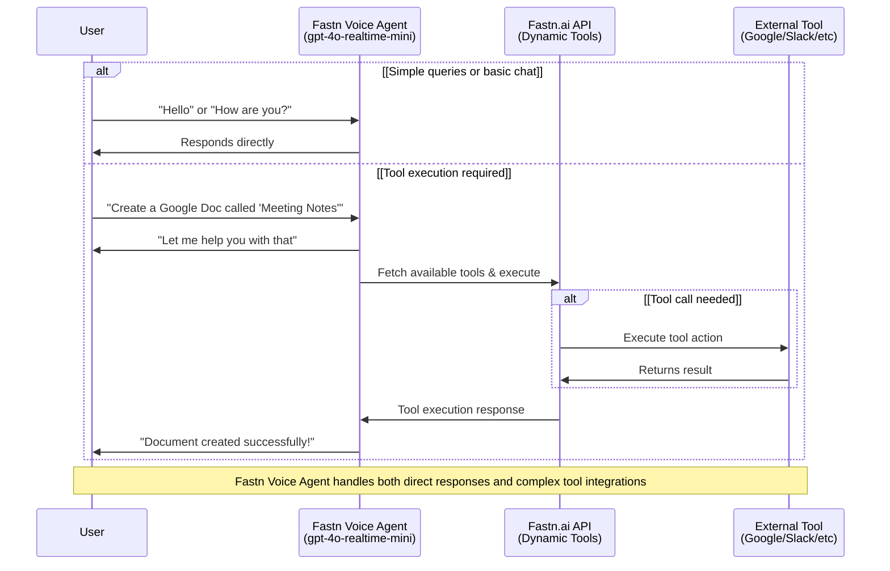

# Fastn Voice Force

A voice-enabled AI assistant powered by the OpenAI Realtime API and OpenAI Agents SDK, featuring specialized agents for Fastn.ai tool integration and documentation assistance. 

## About the OpenAI Agents SDK

This project uses the [OpenAI Agents SDK](https://github.com/openai/openai-agents-js), a toolkit for building, managing, and deploying advanced AI agents. The SDK provides:

- A unified interface for defining agent behaviors and tool integrations.
- Built-in support for agent orchestration, state management, and event handling.
- Easy integration with the OpenAI Realtime API for low-latency, streaming interactions.
- Extensible patterns for multi-agent collaboration, handoffs, tool use, and guardrails.

For full documentation, guides, and API references, see the official [OpenAI Agents SDK Documentation](https://github.com/openai/openai-agents-js#readme).

## Features

This project includes two specialized AI agents:

1. **Fastn Tools Agent:** Dynamically fetches and executes Fastn.ai tools for various integrations including Google Workspace, Slack, and other productivity platforms.
2. **Fastn Docs Agent:** Provides comprehensive assistance with Fastn documentation, best practices, and getting started guidance.

## Setup

### Prerequisites
- Node.js (v16 or higher)
- OpenAI API key
- Fastn.ai API credentials

### Installation

1. **Install Dependencies**
   ```bash
   npm install
   ```

2. **Environment Configuration**
   
   Copy the sample environment file and configure your API keys:
   ```bash
   cp .env.sample .env
   ```
   
   Update `.env` with your credentials:
   ```env
   # OpenAI API Key - Required for voice agent functionality
   OPENAI_API_KEY=your_openai_api_key_here
   
   # Fastn Tools Agent - Get these from https://ucl.dev/
   FASTN_API_KEY=your_fastn_tools_api_key
   FASTN_SPACE_ID=your_fastn_tools_space_id
   ```
   
   > **Note**: The Fastn Docs Agent uses pre-configured credentials and doesn't require additional setup.

### Getting API Credentials

- **OpenAI API Key**: Get your API key from [OpenAI Platform](https://platform.openai.com/api-keys)
- **Fastn Tools API Credentials**: Visit [Fastn UCL Platform](https://ucl.dev/) to:
  - Create your account and workspace
  - Generate API keys for your tools integration
  - Get your Space ID from your workspace settings
  
> The Fastn Docs Agent comes pre-configured with documentation access and doesn't require separate API credentials.

### Running the Application

1. **Start Development Server**
   ```bash
   npm run dev
   ```

2. **Open Application**
   - Navigate to [http://localhost:3000](http://localhost:3000)
   - The app defaults to the `Fastn Tools` Agent
   - Switch between agents using the "Agent Set" dropdown in the bottom toolbar

# Agent Architecture

## Fastn Tools Agent

The Fastn Tools Agent dynamically fetches and executes tools from the Fastn.ai platform. It can:
- Access Google Workspace (Docs, Sheets, Calendar)
- Integrate with Slack for messaging and notifications
- Handle various productivity and workflow automation tasks
- Provide intelligent tool selection based on user requests

## Fastn Docs Agent

The Fastn Docs Agent specializes in providing assistance with Fastn documentation and knowledge base. It can:
- Answer questions about Fastn features and capabilities
- Provide getting started guidance and tutorials
- Explain best practices and usage patterns
- Help troubleshoot common issues
- Offer examples and code snippets

## Screenshots

### Fastn Tools Agent in Action

*The Fastn Tools Agent dynamically executing tools for Google Workspace, Slack, and other integrations*

### Fastn Docs Agent Interface  

*The Fastn Docs Agent providing comprehensive documentation assistance and guidance*

## How It Works



## Benefits
- **Voice-First Interface**: Natural conversation experience with low-latency responses
- **Dynamic Tool Access**: Automatically discovers and uses the latest Fastn.ai tools
- **Specialized Knowledge**: Dedicated documentation agent for comprehensive Fastn guidance  
- **Seamless Integration**: Direct connection to Fastn.ai platform and third-party services
- **Modular Design**: Easy to extend with additional agents for specific use cases
- **Intelligent Routing**: Automatically selects the right tools based on user intent

## Configuration

The application is configured with two main agent sets:

1. **Fastn Tools Agent** (`src/app/agentConfigs/fastnAgent.ts`)
   - Dynamically fetches available tools from Fastn.ai platform
   - Handles complex tool execution workflows
   - Provides intelligent parameter mapping and validation

2. **Fastn Docs Agent** (`src/app/agentConfigs/fastnDocsAgent.ts`)  
   - Connects to Fastn serviceAgent API for documentation queries
   - Provides contextual help and examples
   - Assists with onboarding and troubleshooting

### Adding Custom Agents

To add your own agent:
1. Create a new agent configuration in `src/app/agentConfigs/`
2. Add the agent to the `allAgentSets` mapping in `src/app/agentConfigs/index.ts`
3. Update the UI selector options in `src/app/components/BottomToolbar.tsx`

## API Integration

The application integrates with Fastn.ai through two main endpoints:

- **Tools API**: `https://live.fastn.ai/api/ucl/getTools` - Retrieves available tools
- **Execution API**: `https://live.fastn.ai/api/ucl/executeTool` - Executes tools with parameters  
- **ServiceAgent API**: `https://live.fastn.ai/api/v1/serviceAgent` - Queries documentation

## Usage

### Interacting with Fastn Tools Agent
- "Create a new Google Doc called 'Meeting Notes'"  
- "Send a Slack message to the team channel"
- "Schedule a meeting for tomorrow at 2pm"
- "Add a new row to my project tracking sheet"

### Interacting with Fastn Docs Agent  
- "How do I get started with Fastn?"
- "What integrations does Fastn support?"
- "Show me examples of workflow automation"
- "Help me troubleshoot my API connection"

## Output Guardrails
Assistant messages are checked for safety and compliance before they are shown in the UI.  The guardrail call now lives directly inside `src/app/App.tsx`: when a `response.text.delta` stream starts we mark the message as **IN_PROGRESS**, and once the server emits `guardrail_tripped` or `response.done` we mark the message as **FAIL** or **PASS** respectively.  If you want to change how moderation is triggered or displayed, search for `guardrail_tripped` inside `App.tsx` and tweak the logic there.

## Navigating the UI
- You can switch between agent sets using the "Agent Set" dropdown in the bottom toolbar.
- The conversation transcript is on the left, including tool calls, tool call responses, and agent actions. Click to expand non-message elements.
- The event log is on the right, showing both client and server events. Click to see the full payload.
- On the bottom toolbar, you can disconnect, toggle between automated voice-activity detection or push-to-talk, turn off audio playback, toggle logs, and select different agents.

## Resources

### Fastn Platform
- **[Fastn UCL Platform](https://ucl.dev/)** - Get your API keys and manage your Fastn workspace
- **[Fastn Documentation](https://docs.fastn.ai/)** - Complete guide to Fastn features and integrations

### Developer
- **[Umar Farooq LinkedIn](https://www.linkedin.com/in/umar-farooq-71b99223a/)** - Connect with the developer
- **[Umar Farooq Portfolio](https://umarfarooq75011hglp9l9p.contra.com)** - View portfolio and projects

### OpenAI
- **[OpenAI Platform](https://platform.openai.com/)** - Manage your OpenAI API keys
- **[Realtime API Documentation](https://platform.openai.com/docs/guides/realtime)** - Learn about the Realtime API

## Contributing

This project demonstrates voice-enabled AI agents for Fastn.ai integration. Feel free to extend it with additional agents, tools, or integrations that enhance the Fastn workflow automation experience.

For questions, suggestions, or collaboration opportunities, reach out via [LinkedIn](https://www.linkedin.com/in/umar-farooq-71b99223a/) or check out the [developer's portfolio](https://umarfarooq75011hglp9l9p.contra.com).
